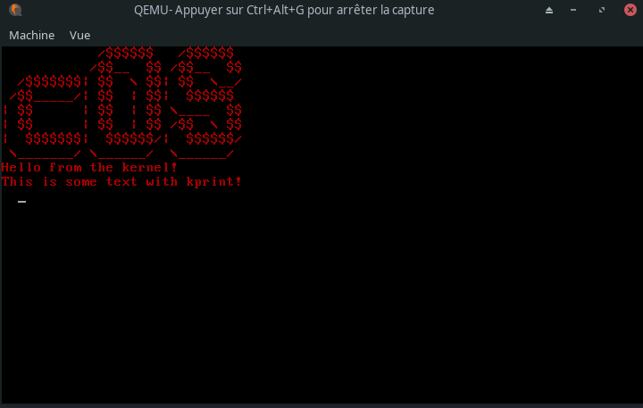
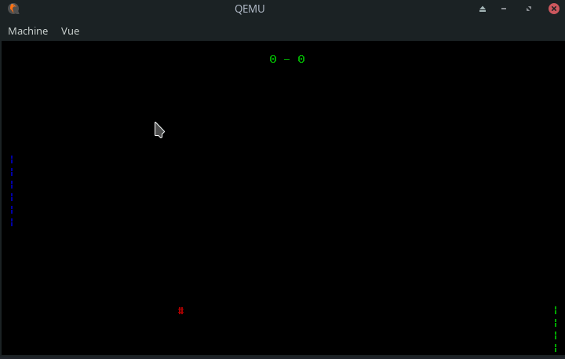

# COS, Operating System made in C

Simple x86 operating system written in c and tested on qemu.

## Demo
These are simple demos showing:
- [x] Show custom colored text 
- [x] Write text with keyboard 
- [x] Get real time user input with keyboard interrupts (No polling).
- [x] Manage precise timings by using hardware timer. 


### Boot logo and keyboard input



### Boot logo and keyboard input


## How to run

### Install tools
```
sudo pacman -S make nasm qemu mtools
sudo apt-get install make nasm qemu mtools 
sudo dnf install make nasm qemu mtools
```

### Build the cross-compiling toolchain
```bash
sudo bash scripts/setup-gcc-arch.sh
```

> You might need to add the toolchain to the path if you're not using the bash shell

### Compile and run
```bash
make
make run
```